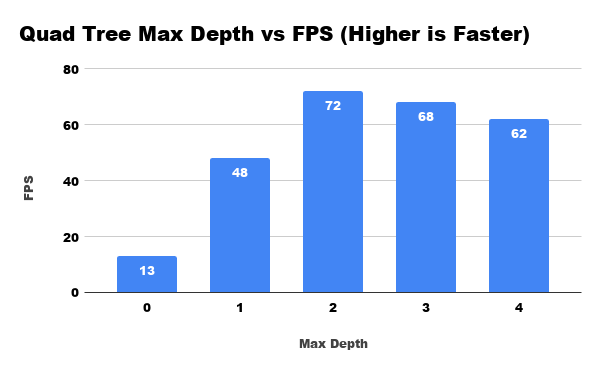

Real Time 3D Water Simulation and Rendering
=========================

* Salaar Kohari and Ishan Ranade
* Tested on: Windows 10, Intel Xeon @ 3.1GHz 32GB, GTX 980 4GB

### Introduction

An open-source repository featuring **real-time Eulerian fluid simulation and rendering** based on SIGGRAPH research, primarily [Real-Time Eulerian Water Simulation Using a Restricted Tall Cell Grid](http://matthias-mueller-fischer.ch/publications/tallCells.pdf). Fluid simulation is performed using discrete Navier Stokes on a collocated MAC grid with marker particles moving through fluid cells. Rendering involves raycasting through a quad tree of particles and shading the result. All parts of the simulation and rendering are implemented on the GPU except the Gauss-Seidel solver and quad tree generation. The simulation calculations alone would take about 10-30 minutes per frame on the CPU, whereas our complete implementation takes **10-30 milliseconds per frame** or up to 100 frames per second depending on parameters.

### Simulation

##### Initialization

- Tune performance parameters (time step, grid resolution, particle count, solver iterations)
- Tune simulation parameters (viscosity, fluid/air density, atmospheric pressure, external forces)
- Allocate memory for grid cells, pressure solver, and marker particles
- Initialize particle positions with initial scene conditions

##### Advection

1. Set cells with marker particles to fluid
2. Apply convection using backwards particle trace
3. Add external forces (gravity/wind)
4. Apply viscosity
5. Setup pressure calculations for solver
6. Gauss-Seidel to solve for pressure (CPU)
7. Velocity fluid/solid extrapolation
8. Move marker particles using cell velocity interpolation

##### Performance

When rendered using OpenGL points instead of raycasting, we can simulate **10.2 million particles** in real-time as shown in the gif above. The graph below shows how the number of particles affects framerate for a 16x32x16 resolution grid.

### Rendering

##### Ray Casting

1. Cull particles below the surface and boundaries
2. Create quad tree hierarchy for marker particles (CPU
3. Launch ray cast kernel for each pixel
4. Check hierarchy for possible water particle collisions
5. Compute ray-sphere intersections for those particles

##### Shading

1. Use depth and normals to color the closest intersection
2. Fill a pbo to display with OpenGL

##### Performance

When rendered using accelerated raycasting, we can simulate **64 thousand particles** in real-time as shown in the gif above. The graph below shows how the maximum hierarchy depth affects framerate for a 16x32x16 resolution grid.

### Build and Run

To run application:

1) Create a "build" folder in the root directory
2) cd into the "build" folder
3) Run the following, replace DCUDA_TOOLKIT_ROOT_DIR with the path to your toolkit:

`cmake -G "Visual Studio 15 2017 Win64" -DCUDA_TOOLKIT_ROOT_DIR="C:/Program Files/NVIDIA GPU Computing Toolkit/CUDA/v9.2" -T v140,cuda=9.2 ..`

4) In the "build" folder you will see a .sln project, open that in Visual Studio

### References

- [Real-Time Eulerian Water Simulation Using a Restricted Tall Cell Grid](http://matthias-mueller-fischer.ch/publications/tallCells.pdf)
- [Fluid Flow for the Rest of Us: Tutorial of the Marker and Cell Method in
Computer Graphics](https://pdfs.semanticscholar.org/9d47/1060d6c48308abcc98dbed850a39dbfea683.pdf)
- Contact us for questions or more references
